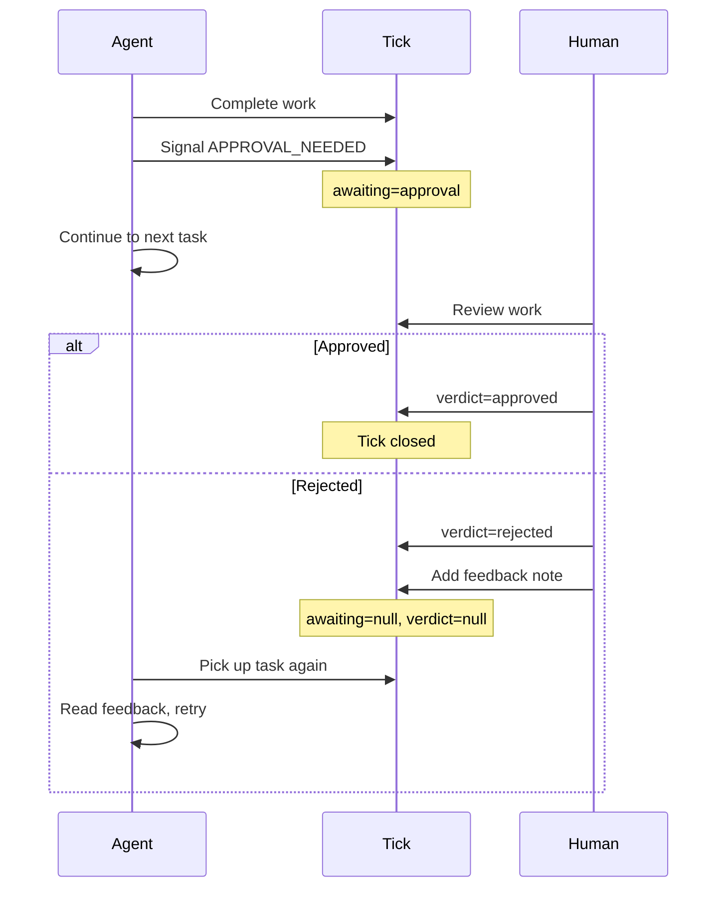
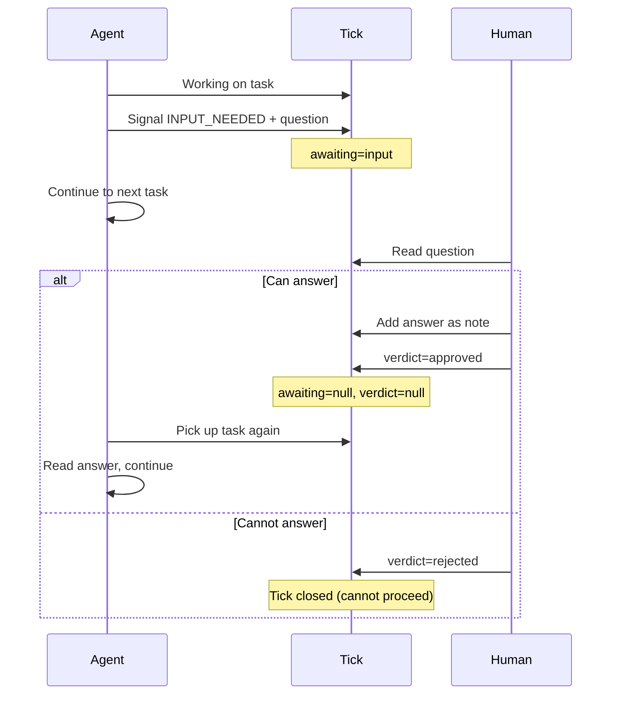
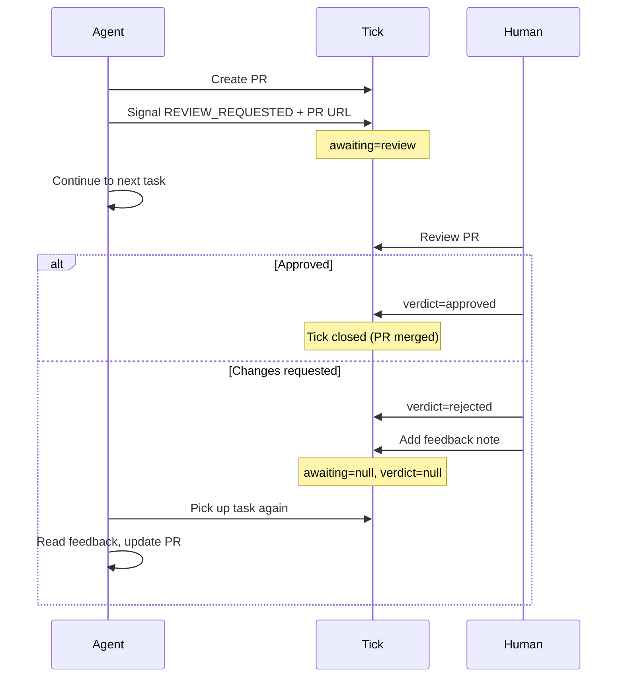
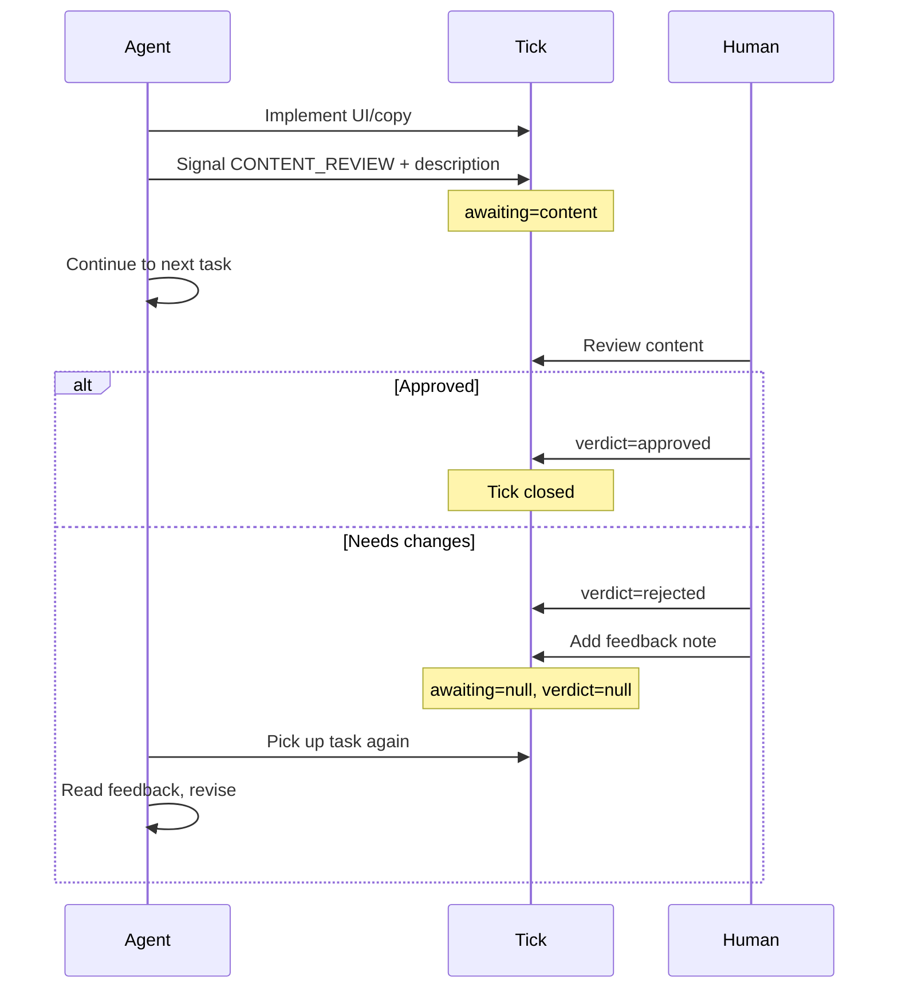
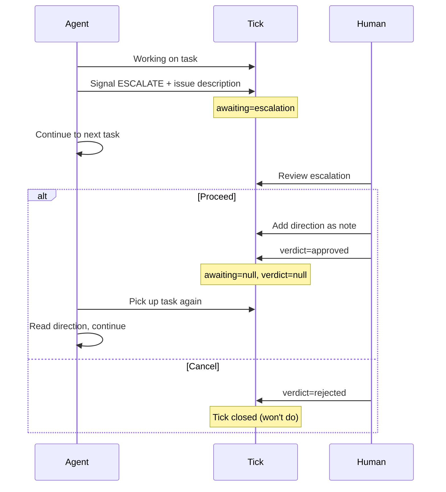
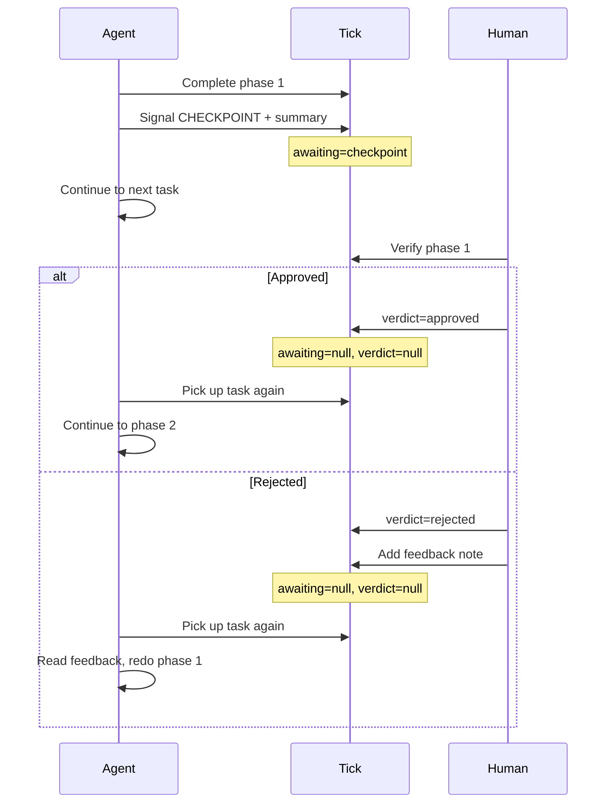
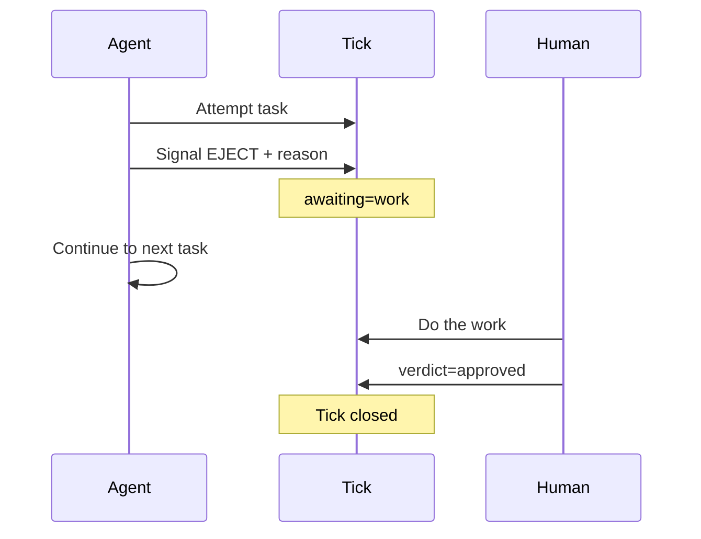
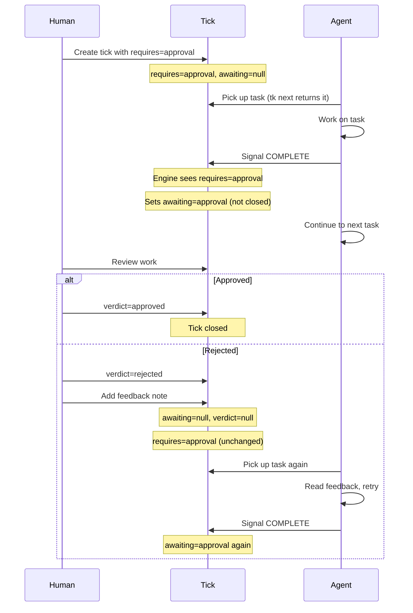
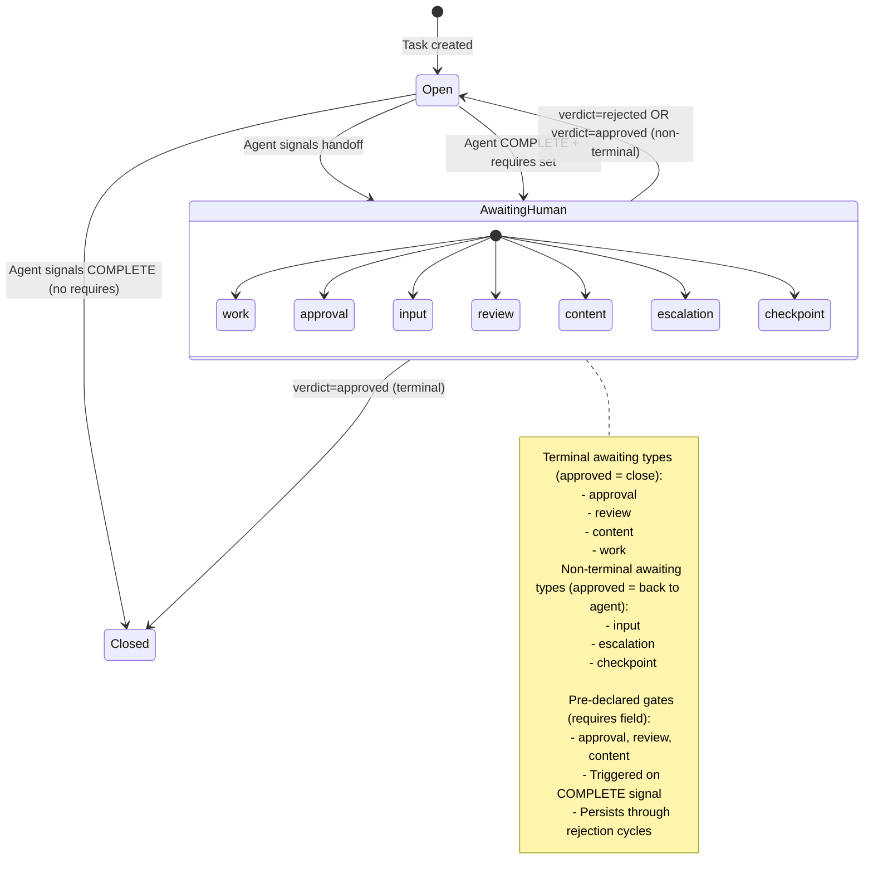
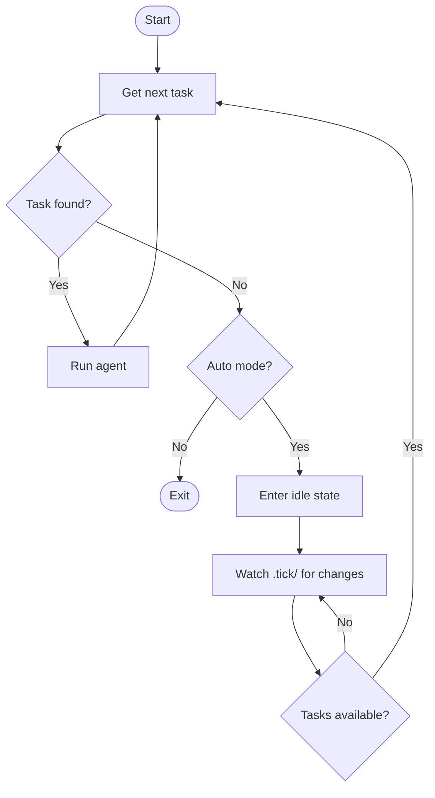

# Agent-Human Workflow Design

This document describes the collaborative workflow between AI agents (via ticker) and humans for task completion in ticks.

## Overview

Currently, ticks has a `manual` boolean flag that makes ticker skip tasks entirely. This document proposes a richer model where:

1. Agents can **hand off** tasks to humans for specific reasons (approval, input, review, etc.)
2. Humans can **respond** with a structured verdict (approved/rejected)
3. Ticker **continues working** on other tasks while waiting for human response
4. After human response, the task either **closes** or **returns to agent** with feedback

## State Model

### Three Enum Fields

```
requires: null | approval | review | content          # pre-declared gate (set at creation, persistent)
awaiting: null | work | approval | input | review | content | escalation | checkpoint  # current state (transient)
verdict:  null | approved | rejected                  # human response (transient)
```

### Requires Field

The `requires` field allows humans to **pre-declare** that a tick needs approval before closing, without relying on agent judgment.

| Value | Meaning |
|-------|---------|
| `null` | No pre-declared gate (default) |
| `approval` | Must have human sign-off before closing |
| `review` | Must have PR review before closing |
| `content` | Must have content/design review before closing |

**Key behavior:** When agent signals `COMPLETE` on a tick with `requires` set, the engine sets `awaiting` to the `requires` value instead of closing the tick.

### Awaiting Values

| Value | Meaning | Human Action Expected |
|-------|---------|----------------------|
| `null` | Agent's turn (default) | - |
| `work` | Human must do the task | Complete the work |
| `approval` | Agent done, needs sign-off | Approve or reject with feedback |
| `input` | Agent needs information | Provide answer (in notes) |
| `review` | PR needs code review | Review and approve or request changes |
| `content` | UI/copy needs human judgment | Judge quality, approve or give feedback |
| `escalation` | Agent found issue, needs direction | Decide how to proceed |
| `checkpoint` | Phase complete, verify before next | Approve to continue or reject to redo |

### Verdict Values

| Value | Meaning |
|-------|---------|
| `null` | No response yet (default) |
| `approved` | Human accepts/approves |
| `rejected` | Human rejects, needs changes |

### Notes

Freeform context (questions, feedback, answers) goes in notes. Notes are **supplementary** - they don't drive state transitions, but provide context for both agent and human.

## Workflow Scenarios

### 1. Approval Gate

Agent completes work but needs human sign-off before closing.

**Examples:** Security changes, database migrations, API changes



### 2. Input Required

Agent needs information only human can provide.

**Examples:** Business decisions, configuration choices, clarifications



### 3. PR Review

Agent creates PR but shouldn't merge without review.

**Examples:** Any code changes requiring review



### 4. Content/Design Review

Agent creates UI, copy, or design that needs human judgment.

**Examples:** Error messages, UI layouts, marketing copy, user-facing text



### 5. Escalation

Agent discovers something unexpected requiring human decision.

**Examples:** Security vulnerabilities, scope creep, architectural decisions



### 6. Checkpoint

Large task with intermediate verification points.

**Examples:** Data migrations, multi-phase refactors



### 7. Human Work (Eject)

Task requires human to complete (not just approve).

**Examples:** Manual configuration, physical setup, external system access



### 8. Pre-Declared Approval Gate

Human knows upfront that a tick needs approval, regardless of agent judgment.

**Examples:** All security changes, all API changes, all UI work for a specific epic



**Key differences from agent-initiated approval:**
- Human sets `requires` at creation time, not agent at completion time
- `requires` persists through rejection cycles (agent can't bypass it)
- Agent doesn't need to know or decide whether approval is needed

## State Transition Diagram



## Verdict Processing Matrix

| awaiting | verdict=approved | verdict=rejected |
|----------|------------------|------------------|
| `work` | Close tick | (invalid - human couldn't do it?) |
| `approval` | Close tick | Back to agent (with feedback) |
| `input` | Back to agent (with answer) | Close tick (can't proceed) |
| `review` | Close tick (merge PR) | Back to agent (with feedback) |
| `content` | Close tick | Back to agent (with feedback) |
| `escalation` | Back to agent (with direction) | Close tick (won't do) |
| `checkpoint` | Back to agent (next phase) | Back to agent (redo phase) |

## Agent Signal Protocol

Agents communicate via XML tags in output:

| Signal | Tag Format | Sets awaiting |
|--------|------------|---------------|
| Complete | `<promise>COMPLETE</promise>` | - (closes tick) |
| Eject | `<promise>EJECT: reason</promise>` | `work` |
| Approval needed | `<promise>APPROVAL_NEEDED: reason</promise>` | `approval` |
| Input needed | `<promise>INPUT_NEEDED: question</promise>` | `input` |
| Review requested | `<promise>REVIEW_REQUESTED: pr_url</promise>` | `review` |
| Content review | `<promise>CONTENT_REVIEW: description</promise>` | `content` |
| Escalate | `<promise>ESCALATE: issue</promise>` | `escalation` |
| Checkpoint | `<promise>CHECKPOINT: summary</promise>` | `checkpoint` |

The text after the colon is added as a note to provide context.

## Ticker Engine Loop


**Key behavior:** Ticker **never blocks** on human. After any handoff signal, it immediately proceeds to the next available task.

---

# Implementation: Changes to Ticks (tk CLI)

## Schema Changes

### New Fields

Add to tick schema:

```go
type Tick struct {
    // ... existing fields ...

    // Requires declares a gate that must be passed before closing
    // Set at creation time, persists through the tick lifecycle
    Requires *string `json:"requires,omitempty"` // approval|review|content

    // Awaiting indicates the tick is waiting for human action
    // null means agent's turn, any other value means human's turn
    Awaiting *string `json:"awaiting,omitempty"` // work|approval|input|review|content|escalation|checkpoint

    // Verdict is the human's response to an awaiting state
    // Processed immediately when set, then cleared
    Verdict *string `json:"verdict,omitempty"` // approved|rejected
}
```

### Deprecate Manual Field

The `manual` field is superseded by `awaiting=work`:

```go
// Deprecated: Use Awaiting="work" instead
Manual bool `json:"manual,omitempty"`
```

Migration: `manual: true` → `awaiting: "work"`

## CLI Changes

### New Flags

```bash
# Create with pre-declared approval gate
tk create "Security-sensitive task" --requires approval
tk create "UI redesign" --requires content
tk create "API change" --requires review

# Create with awaiting (immediate human assignment)
tk create "Task title" --awaiting work

# Update awaiting
tk update <id> --awaiting approval
tk update <id> --awaiting=null  # clear, return to agent

# Set verdict
tk update <id> --verdict approved
tk update <id> --verdict rejected
```

### New Filter Options

```bash
# List tasks awaiting human
tk list --awaiting              # all awaiting != null
tk list --awaiting approval     # specific type
tk list --awaiting input,review # multiple types

# Ready excludes awaiting (like it excludes manual)
tk ready                        # awaiting=null AND not blocked AND open
```

### Shorthand Commands

```bash
# Approve (verdict=approved, triggers processing)
tk approve <id>

# Reject with optional feedback note
tk reject <id>
tk reject <id> "Needs softer error messages"
```

### Note Author Flag

```bash
# Agent note (default, or explicit)
tk note <id> "PR ready: github.com/..."
tk note <id> "Context info" --from agent

# Human note (feedback, answers)
tk note <id> "Use Stripe for payments" --from human
```

## Verdict Processing Logic

When verdict is set, `tk` processes immediately:

```go
func processVerdict(tick *Tick) error {
    if tick.Verdict == nil || tick.Awaiting == nil {
        return nil
    }

    shouldClose := false

    switch *tick.Awaiting {
    case "work":
        // Human completed work
        shouldClose = (*tick.Verdict == "approved")
    case "approval", "review", "content":
        // Terminal states - approved means done
        shouldClose = (*tick.Verdict == "approved")
    case "input":
        // Approved = answer provided, continue; Rejected = can't proceed
        shouldClose = (*tick.Verdict == "rejected")
    case "escalation":
        // Approved = direction given, continue; Rejected = won't do
        shouldClose = (*tick.Verdict == "rejected")
    case "checkpoint":
        // Never closes - always back to agent
        shouldClose = false
    }

    // Clear state
    tick.Awaiting = nil
    tick.Verdict = nil

    if shouldClose {
        tick.Status = "closed"
    }

    return saveTick(tick)
}
```

## Query Changes

### tk next

Exclude tasks with `awaiting` set:

```go
func getNextTask(epicID string) *Tick {
    // Existing filters: open, not blocked, not manual
    // Add: awaiting == null

    tasks := listTasks(epicID)
    for _, t := range tasks {
        if t.Status == "open" &&
           !t.isBlocked() &&
           t.Awaiting == nil {  // NEW
            return &t
        }
    }
    return nil
}
```

### tk ready

Same filter - exclude awaiting:

```bash
tk ready  # only shows awaiting=null tasks
```

---

# Implementation: Changes to Ticker (Engine)

## Signal Detection

### Extend Signal Parsing

Current signals:
- `COMPLETE`
- `EJECT`
- `BLOCKED`

New signals to detect:

```go
type Signal string

const (
    SignalComplete        Signal = "COMPLETE"
    SignalEject           Signal = "EJECT"
    SignalBlocked         Signal = "BLOCKED"          // Legacy, maps to input
    SignalApprovalNeeded  Signal = "APPROVAL_NEEDED"
    SignalInputNeeded     Signal = "INPUT_NEEDED"
    SignalReviewRequested Signal = "REVIEW_REQUESTED"
    SignalContentReview   Signal = "CONTENT_REVIEW"
    SignalEscalate        Signal = "ESCALATE"
    SignalCheckpoint      Signal = "CHECKPOINT"
)

// ParseSignal extracts signal from agent output
func ParseSignal(output string) (Signal, string) {
    // Match <promise>SIGNAL_TYPE: context</promise>
    // or <promise>SIGNAL_TYPE</promise>

    re := regexp.MustCompile(`<promise>(\w+)(?::\s*(.+?))?</promise>`)
    matches := re.FindStringSubmatch(output)
    if matches == nil {
        return "", ""
    }
    return Signal(matches[1]), strings.TrimSpace(matches[2])
}
```

## Signal Handling

### Map Signals to Awaiting

```go
func (e *Engine) handleSignal(tick *Tick, signal Signal, context string) error {
    switch signal {
    case SignalComplete:
        // Check for pre-declared approval gate
        if tick.Requires != "" {
            return e.setAwaiting(tick, tick.Requires, "Work complete, requires "+tick.Requires)
        }
        return e.ticks.Close(tick.ID, "Completed by agent")

    case SignalEject:
        return e.setAwaiting(tick, "work", context)

    case SignalBlocked:
        // Legacy signal - treat as input needed
        return e.setAwaiting(tick, "input", context)

    case SignalApprovalNeeded:
        return e.setAwaiting(tick, "approval", context)

    case SignalInputNeeded:
        return e.setAwaiting(tick, "input", context)

    case SignalReviewRequested:
        return e.setAwaiting(tick, "review", context)

    case SignalContentReview:
        return e.setAwaiting(tick, "content", context)

    case SignalEscalate:
        return e.setAwaiting(tick, "escalation", context)

    case SignalCheckpoint:
        return e.setAwaiting(tick, "checkpoint", context)
    }
    return nil
}

func (e *Engine) setAwaiting(tick *Tick, awaiting, context string) error {
    // Update tick awaiting status
    if err := e.ticks.Update(tick.ID, "--awaiting", awaiting); err != nil {
        return err
    }

    // Add context as note
    if context != "" {
        if err := e.ticks.Note(tick.ID, context); err != nil {
            return err
        }
    }

    return nil
}
```

## Loop Changes

### Non-Blocking on Handoff

```go
func (e *Engine) Run(epicID string) error {
    for {
        // Check budget
        if e.budget.Exhausted() {
            return ErrBudgetExhausted
        }

        // Get next available task
        tick, err := e.ticks.Next(epicID)
        if err != nil {
            return err
        }
        if tick == nil {
            // No tasks available (all done or awaiting human)
            return nil
        }

        // Build context (include recent notes for feedback)
        context := e.buildContext(tick)

        // Run agent
        output, err := e.agent.Run(tick, context)
        if err != nil {
            return err
        }

        // Detect and handle signal
        signal, signalContext := ParseSignal(output)
        if signal != "" {
            if err := e.handleSignal(tick, signal, signalContext); err != nil {
                return err
            }
            // IMPORTANT: Continue to next task, don't block
            continue
        }

        // No signal - check iteration limits, continue or pause
        // ... existing logic ...
    }
}
```

### Context Building

Include recent notes when returning to a task after human feedback:

```go
func (e *Engine) buildContext(tick *Tick) string {
    var context strings.Builder

    // Get recent notes
    notes, _ := e.ticks.Notes(tick.ID)

    // Check if there's human feedback (from recent verdict processing)
    humanNotes := filterHumanNotes(notes)
    if len(humanNotes) > 0 {
        context.WriteString("## Human Feedback\n\n")
        context.WriteString("This task was previously handed to a human. Their response:\n\n")
        for _, note := range humanNotes {
            context.WriteString(fmt.Sprintf("- %s\n", note.Content))
        }
        context.WriteString("\nAddress this feedback before proceeding.\n\n")
    }

    return context.String()
}
```

## Agent Prompt Updates

### System Prompt Addition

Add to agent system prompt:

```markdown
## Handoff Signals

When you need human involvement, emit a signal and the system will hand off the task:

| Signal | When to Use |
|--------|-------------|
| `<promise>COMPLETE</promise>` | Task fully done |
| `<promise>APPROVAL_NEEDED: reason</promise>` | Work complete, needs human sign-off (security, migrations, API changes) |
| `<promise>INPUT_NEEDED: question</promise>` | Need human to answer a question or make a decision |
| `<promise>REVIEW_REQUESTED: pr_url</promise>` | PR created, needs code review |
| `<promise>CONTENT_REVIEW: description</promise>` | UI/copy/design needs human judgment |
| `<promise>ESCALATE: issue</promise>` | Found unexpected issue requiring human direction |
| `<promise>CHECKPOINT: summary</promise>` | Completed a phase, need verification before continuing |
| `<promise>EJECT: reason</promise>` | Cannot complete - requires human to do the work |

After emitting a handoff signal, the system will move to another task. When a human responds, you may be assigned this task again with their feedback in the notes.

## Reading Human Feedback

If this task was previously handed off, check the "Human Feedback" section above for the human's response. Address their feedback before proceeding.
```

---

# Migration Path

## Phase 1: Add Fields to Ticks (v2.0)

1. Add `requires`, `awaiting`, and `verdict` fields to schema
2. Add CLI flags (`--requires`, `--awaiting`, `--verdict`)
3. Add `tk approve` and `tk reject` commands
4. Update `tk next` and `tk ready` to exclude awaiting
5. Keep `manual` field working (deprecated but functional)

## Phase 2: Update Ticker Engine (v2.0)

1. Add new signal detection
2. Add signal → awaiting mapping
3. Change loop to continue after handoff signals
4. Add context building with human feedback

## Phase 3: Deprecate Manual (v2.x)

1. Show deprecation warning when `--manual` is used
2. `--manual` becomes alias for `--awaiting work`

## Phase 4: Remove Manual (v3.0 - Breaking)

1. Remove `manual` field from schema
2. Remove `--manual` flag from CLI
3. Migration script to convert old data

---

# Backwards Compatibility

## The Problem

Existing ticks may have `manual: true` set. Existing scripts and user habits use `--manual` flag. We need to support both old and new without breaking existing workflows.

## Compatibility Matrix

| Version | `manual` field | `--manual` flag | `awaiting` field | Behavior |
|---------|----------------|-----------------|------------------|----------|
| v1.x (current) | read/write | supported | n/a | Current behavior |
| v2.0 (new) | read-only | deprecated | read/write | Reads both, writes `awaiting` |
| v3.0 (future) | removed | removed | read/write | Breaking change |

## Implementation Details

### Reading Ticks (v2.0)

```go
func (t *Tick) IsAwaitingHuman() bool {
    // New field takes precedence
    if t.Awaiting != "" {
        return true
    }
    // Backwards compat: check old field
    return t.Manual
}

func (t *Tick) GetAwaitingType() string {
    if t.Awaiting != "" {
        return t.Awaiting
    }
    // Backwards compat: manual maps to "work"
    if t.Manual {
        return "work"
    }
    return ""
}
```

### Writing Ticks (v2.0)

```go
func (t *Tick) SetAwaiting(value string) {
    t.Awaiting = value
    // Clear old field to avoid confusion
    t.Manual = false
}
```

### CLI Flag Handling (v2.0)

```go
func handleManualFlag(cmd *cobra.Command) {
    if cmd.Flags().Changed("manual") {
        fmt.Fprintln(os.Stderr, "Warning: --manual is deprecated, use --awaiting work instead")
        // Map to new field
        awaiting = "work"
    }
}
```

### Query Filters (v2.0)

```go
func filterReady(ticks []Tick) []Tick {
    var ready []Tick
    for _, t := range ticks {
        // Check both fields for backwards compat
        if t.Awaiting == "" && !t.Manual && !t.isBlocked() {
            ready = append(ready, t)
        }
    }
    return ready
}
```

## Data Migration (v3.0)

Before removing `manual` field in v3.0, provide migration:

```bash
# Migrate all manual:true ticks to awaiting:work
tk migrate --manual-to-awaiting

# Or automatic on first run of v3.0
tk version  # "Migrating 42 ticks from manual to awaiting..."
```

```go
func migrateManualToAwaiting() error {
    ticks := listAllTicks()
    for _, t := range ticks {
        if t.Manual && t.Awaiting == "" {
            t.Awaiting = "work"
            t.Manual = false
            saveTick(t)
        }
    }
    return nil
}
```

---

# Future Considerations

## Notification System

How does human know there's work waiting?

- CLI: `tk list --awaiting` in a watch loop
- Integration: Slack/email notifications
- Dashboard: Web UI showing pending items

## Timeout Handling

What if human doesn't respond?

- Auto-escalate after N days?
- Notify/remind?
- Allow agent to retry with different approach?

## Reviewer Routing

Different humans for different review types:

```
awaiting: content
reviewer: design  # optional field for routing
```

## Audit Trail

Track handoff history:

```
handoff_history: [
  { signal: "APPROVAL_NEEDED", timestamp: "...", context: "..." },
  { verdict: "rejected", timestamp: "...", feedback: "..." },
  { signal: "APPROVAL_NEEDED", timestamp: "...", context: "..." },
  { verdict: "approved", timestamp: "..." }
]
```

---

# LLM/Agent Workflow Instructions

This section provides detailed instructions for LLMs operating as agents within the ticker system. These instructions should be included in agent system prompts and ticker skill definitions.

## Agent System Prompt (for ticker)

Include this in the agent's system prompt:

```markdown
# Ticker Task Execution

You are working on tasks managed by the ticker system. Each task comes from a tick (issue) in the ticks issue tracker.

## Completing Tasks

When you finish a task, emit one of these signals:

### Task Complete
If you have fully completed the task with no issues:
<promise>COMPLETE</promise>

### Need Human Approval
If the work is done but should be reviewed before closing (security changes, migrations, API changes):
<promise>APPROVAL_NEEDED: Brief description of what needs approval</promise>

### Need Human Input
If you need information or a decision from a human to proceed:
<promise>INPUT_NEEDED: Your specific question here</promise>

### PR Ready for Review
If you created a pull request that needs code review:
<promise>REVIEW_REQUESTED: https://github.com/org/repo/pull/123</promise>

### Content Needs Review
If you created UI, copy, or design work that needs human judgment:
<promise>CONTENT_REVIEW: Description of what to review (e.g., "New error messages in PaymentForm")</promise>

### Found Unexpected Issue
If you discovered something that needs human decision (security issue, scope creep, architectural choice):
<promise>ESCALATE: Description of the issue and options</promise>

### Checkpoint (Multi-Phase Work)
If you completed a phase and need verification before continuing:
<promise>CHECKPOINT: Summary of completed phase and what's next</promise>

### Cannot Complete (Human Must Do It)
If the task requires human action (credentials, physical setup, external access):
<promise>EJECT: Reason why human must do this</promise>

## Reading Human Feedback

When you pick up a task, check the notes for human feedback. If you see notes marked as human feedback:
1. Read and understand the feedback
2. Address all points raised
3. Then proceed with the task

## Pre-Declared Gates

Some tasks have `requires` set (e.g., `requires: approval`). You don't need to handle this - just signal COMPLETE when done, and the system will automatically route to human approval.

## Important Rules

1. **One signal per task** - Emit exactly one signal when done
2. **Be specific** - Include helpful context after the colon
3. **Don't guess** - If you need human input, ask via INPUT_NEEDED
4. **Don't skip gates** - If something feels like it needs approval, use APPROVAL_NEEDED
```

## Ticker Skill Definition

For LLM orchestration systems that use skill/tool definitions:

```yaml
name: ticker
description: |
  Ticker orchestrates AI agents to complete tasks from the ticks issue tracker.
  The agent works on tasks sequentially, signaling completion or handoff to humans.

signals:
  COMPLETE:
    description: Task fully completed, close the tick
    format: "<promise>COMPLETE</promise>"

  APPROVAL_NEEDED:
    description: Work done but needs human sign-off before closing
    format: "<promise>APPROVAL_NEEDED: reason</promise>"
    when_to_use:
      - Security-sensitive changes
      - Database migrations
      - API contract changes
      - Dependency major version upgrades
      - Anything with significant risk

  INPUT_NEEDED:
    description: Agent needs information or decision from human
    format: "<promise>INPUT_NEEDED: question</promise>"
    when_to_use:
      - Business logic decisions
      - Configuration choices
      - Clarification on requirements
      - "Which X should I use?" questions

  REVIEW_REQUESTED:
    description: PR created, needs code review
    format: "<promise>REVIEW_REQUESTED: pr_url</promise>"
    when_to_use:
      - After creating any pull request
      - Include full PR URL

  CONTENT_REVIEW:
    description: UI, copy, or design needs human judgment
    format: "<promise>CONTENT_REVIEW: description</promise>"
    when_to_use:
      - User-facing text changes
      - UI component styling
      - Error messages
      - Marketing copy
      - Anything subjective

  ESCALATE:
    description: Unexpected issue found, needs human direction
    format: "<promise>ESCALATE: issue</promise>"
    when_to_use:
      - Security vulnerabilities discovered
      - Scope larger than expected
      - Architectural decisions needed
      - Conflicting requirements

  CHECKPOINT:
    description: Phase complete, verify before next phase
    format: "<promise>CHECKPOINT: summary</promise>"
    when_to_use:
      - Multi-phase migrations
      - Large refactors (verify approach on one module)
      - Any work where early validation saves rework

  EJECT:
    description: Task requires human to complete
    format: "<promise>EJECT: reason</promise>"
    when_to_use:
      - Needs credentials agent doesn't have
      - Physical or manual setup required
      - External system access needed
      - Agent genuinely cannot do it

workflow:
  on_task_start:
    - Read task description from tick
    - Check notes for human feedback (if returning to task)
    - Address any feedback before proceeding

  on_task_complete:
    - Emit exactly one signal
    - Include helpful context
    - System routes to next task or human

human_feedback:
  location: tick notes (marked with --from human)
  when_present:
    - Previous handoff was rejected
    - Human provided requested input
    - Human gave direction on escalation
  action: Address all feedback points before proceeding
```

---

# CLI Help Text Examples

## ticks (tk) CLI Help

### tk create

```
tk create - Create a new tick

USAGE:
    tk create <title> [flags]

FLAGS:
    -d, --description string   Tick description
    -t, --type string          Tick type: task, epic (default "task")
    -p, --priority int         Priority: 0=critical, 1=high, 2=medium, 3=low, 4=backlog (default 2)
    -l, --labels string        Comma-separated labels
    --parent string            Parent epic ID
    --blocked-by string        ID of blocking tick

    --requires string          Pre-declared approval gate: approval, review, content
                               Tick will route to human after agent completes
    --awaiting string          Immediate human assignment: work, approval, input, review, content, escalation, checkpoint
                               Tick will be skipped by agent until human responds

    --manual                   [DEPRECATED] Use --awaiting=work instead

EXAMPLES:
    # Simple task
    tk create "Fix login bug" -d "Users can't login with SSO"

    # Task requiring approval before closing
    tk create "Update auth flow" --requires approval

    # Task requiring content review (UI/copy)
    tk create "Redesign error messages" --requires content

    # Task assigned directly to human
    tk create "Configure AWS credentials" --awaiting work

    # Task under an epic
    tk create "Implement payment API" --parent epic-123
```

### tk approve / tk reject

```
tk approve - Approve a tick awaiting human verdict

USAGE:
    tk approve <id>

DESCRIPTION:
    Sets verdict=approved on the tick. Depending on the awaiting type:
    - approval, review, content, work: Closes the tick
    - input, escalation, checkpoint: Returns tick to agent queue

EXAMPLES:
    tk approve abc123

---

tk reject - Reject a tick awaiting human verdict

USAGE:
    tk reject <id> [feedback]

DESCRIPTION:
    Sets verdict=rejected on the tick. Adds optional feedback as a human note.
    Tick returns to agent queue (or closes for input/escalation rejection).

EXAMPLES:
    tk reject abc123
    tk reject abc123 "Error messages too harsh, soften the tone"
```

### tk list --awaiting

```
tk list - List ticks

USAGE:
    tk list [flags]

FLAGS:
    --awaiting [type]      Filter by awaiting status
                           No value: all ticks awaiting human
                           With value: specific type(s), comma-separated

EXAMPLES:
    # All ticks awaiting human action
    tk list --awaiting

    # Only ticks awaiting approval
    tk list --awaiting approval

    # Ticks awaiting approval or review
    tk list --awaiting approval,review

    # Show what needs your attention
    tk list --awaiting --json | jq '.[] | {id, title, awaiting}'
```

### tk next --awaiting

```
tk next - Get next task to work on

USAGE:
    tk next [epic-id] [flags]

FLAGS:
    --awaiting [type]      Get next task awaiting human (instead of agent)
                           No value: any awaiting type
                           With value: specific type(s), comma-separated

DESCRIPTION:
    Without --awaiting: Returns next task for agent (awaiting=null, not blocked, open)
    With --awaiting: Returns next task for human (awaiting!=null)

    Tasks are returned in priority order (lowest priority number first).

EXAMPLES:
    # Agent's next task
    tk next epic-123

    # Human's next task (any type)
    tk next epic-123 --awaiting

    # Human's next approval to review
    tk next epic-123 --awaiting approval

    # Human's next content or review task
    tk next epic-123 --awaiting content,review

    # Human's next task across all epics
    tk next --awaiting
```

### tk note

```
tk note - Add a note to a tick

USAGE:
    tk note <id> <message> [flags]

FLAGS:
    --from string    Note author: agent, human (default "agent")

DESCRIPTION:
    Notes provide context for agent-human handoffs:
    - Agent notes: Context about work, questions, PR links
    - Human notes: Feedback, answers, direction

    The --from flag helps distinguish note sources for the agent.

EXAMPLES:
    # Agent adding context
    tk note abc123 "PR ready: https://github.com/org/repo/pull/456"

    # Human providing feedback (after rejection)
    tk note abc123 "Use friendlier language in error messages" --from human

    # Human answering a question
    tk note abc123 "Use Stripe for payment processing" --from human
```

## ticker CLI Help

### ticker run

```
ticker run - Run the ticker engine on an epic

USAGE:
    ticker run <epic-id> [flags]
    ticker run --auto [flags]

FLAGS:
    --headless          Run without TUI
    --auto              Auto-select next ready epic
    --max-iterations    Maximum iterations per task (default 10)
    --max-cost          Maximum cost in dollars (default 10.0)

DESCRIPTION:
    Ticker runs AI agents on tasks within an epic. The engine:

    1. Gets next available task (tk next)
    2. Runs agent on task
    3. Detects agent signal (COMPLETE, APPROVAL_NEEDED, etc.)
    4. Updates tick state accordingly
    5. Continues to next task (never blocks on human)

AGENT SIGNALS:
    COMPLETE           Task done, close tick
    APPROVAL_NEEDED    Work done, needs human sign-off
    INPUT_NEEDED       Agent needs information from human
    REVIEW_REQUESTED   PR needs code review
    CONTENT_REVIEW     UI/copy needs human judgment
    ESCALATE           Found issue, needs human direction
    CHECKPOINT         Phase done, needs verification
    EJECT              Agent can't do it, human must

TASK FILTERING:
    Ticker skips tasks where:
    - awaiting is set (waiting for human)
    - blocked by another task
    - status is closed

HUMAN WORKFLOW:
    While ticker runs, humans can:
    - tk next --awaiting        Get next task needing human attention
    - tk list --awaiting        See all tasks needing attention
    - tk approve <id>           Approve completed work
    - tk reject <id> "reason"   Reject with feedback

    Approved/rejected tasks return to the queue for ticker to pick up.

EXAMPLES:
    # Run on specific epic
    ticker run epic-abc123

    # Run headless (CI/automation)
    ticker run epic-abc123 --headless

    # Auto-select next epic
    ticker run --auto
```

---

# Auto Mode and Idle Behavior

## Problem

When ticker runs on an epic and exhausts all available tasks (all awaiting human or done), it needs to **wait** for tasks to become available again rather than exit immediately.

## Auto Mode Design (Implemented)

```
ticker run --auto
```

Behavior:
1. Auto-select next ready epic (or use specified epic)
2. Process all available tasks
3. When no tasks available, enter idle state with file system watcher on `.tick/`
4. When task becomes available (human approves/rejects), resume processing
5. Exit only on explicit quit or budget exhaustion



### CLI Flags

```bash
ticker run --auto              # Auto-select epic, watch for changes
ticker run <epic-id>           # Run specific epic (no watching)
ticker run <epic-id> --headless # Run headless without TUI
```

---

# Race Condition Prevention

## Problem

When a human responds to a tick, they might make multiple edits:

```bash
tk reject abc123                          # Clear awaiting
tk note abc123 "feedback" --from human    # Add feedback
```

If ticker picks up the task between these commands, the agent won't see the feedback note.

## Solutions

### Option A: Atomic Commands (Recommended)

Make `tk reject` and `tk approve` include note in single operation:

```bash
tk reject abc123 "feedback"   # Sets verdict + adds note atomically
```

This is already in the design. The note is added **before** the verdict is processed.

### Option B: Debounce

Ticker waits a short period after a task becomes available before picking it up:

```go
func (e *Engine) getNextTask() *Tick {
    tick := e.ticks.Next(epicID)
    if tick == nil {
        return nil
    }

    // Wait for potential follow-up edits
    time.Sleep(2 * time.Second)

    // Re-fetch to get any updates
    return e.ticks.Get(tick.ID)
}
```

Downside: Adds latency to all task pickups.

### Option C: Explicit Release

Human must explicitly release task back to agent:

```bash
tk reject abc123 "feedback"   # Sets verdict, but awaiting stays set
tk release abc123             # Now clears awaiting
```

Downside: Extra step for humans, easy to forget.

### Recommendation

Use **Option A** (atomic commands) as primary mechanism:
- `tk reject <id> "feedback"` is a single atomic operation
- Note is added first, then verdict processed
- No race window

Add **Option B** (debounce) as defense-in-depth:
- Short debounce (1-2 seconds) on task pickup
- Configurable: `ticker run --debounce 2s`
- Catches edge cases like slow file system sync

---

# Orphaned Ticks and Auto Mode

## Problem

Currently, `tk next <epic-id>` only returns tasks within a specific epic. But what about:
- Standalone ticks (no parent epic)
- Ticks orphaned from their epic (epic closed but tasks remain)

## Auto Mode Scope

### Current Behavior

```bash
ticker run --auto  # Picks next ready epic, runs tasks within it
```

### Proposed Enhancement

Auto mode should also consider:
1. **Epics with ready tasks** (current behavior)
2. **Standalone tasks** (no parent epic, not awaiting)
3. **Orphaned tasks** (parent epic closed, task still open)

### Priority Order

```
1. Active epics with in-progress work (continue momentum)
2. Epics with ready tasks (start new epic work)
3. Standalone tasks (housekeeping)
4. Orphaned tasks (cleanup)
```

### Implementation

```go
func (e *Engine) getNextWork() (*Epic, *Tick) {
    // 1. Check current epic (if any) for more tasks
    if e.currentEpic != nil {
        if tick := e.ticks.Next(e.currentEpic.ID); tick != nil {
            return e.currentEpic, tick
        }
    }

    // 2. Find epics with ready tasks
    epics := e.ticks.ListEpics(WithReadyTasks())
    if len(epics) > 0 {
        epic := epics[0] // Could sort by priority
        tick := e.ticks.Next(epic.ID)
        return epic, tick
    }

    // 3. Find standalone tasks (no parent)
    standalones := e.ticks.List(NoParent(), Ready())
    if len(standalones) > 0 {
        return nil, standalones[0]
    }

    // 4. Find orphaned tasks (parent closed)
    orphans := e.ticks.List(ParentClosed(), Ready())
    if len(orphans) > 0 {
        return nil, orphans[0]
    }

    return nil, nil
}
```

### CLI Support

```bash
# Current: only epics
ticker run --auto

# With standalone/orphan support
ticker run --auto --include-standalone   # Include tasks without parent
ticker run --auto --include-orphans      # Include tasks with closed parent
ticker run --auto --all                  # Include everything
```

### tk next Enhancement

```bash
# Get next task across all epics and standalone
tk next                    # Next task (any epic or standalone)
tk next --epic epic-123    # Next task in specific epic
tk next --standalone       # Next standalone task only
tk next --orphan           # Next orphaned task only
```

---

# Implementation Checklist

## ticks (tk CLI)

- [x] Add `requires` field to tick schema
- [x] Add `awaiting` field to tick schema
- [x] Add `verdict` field to tick schema
- [x] Add `--requires` flag to `tk create` and `tk update`
- [x] Add `--awaiting` flag to `tk create` and `tk update`
- [x] Add `--verdict` flag to `tk update`
- [x] Add `tk approve` command
- [x] Add `tk reject` command
- [x] Add `--from` flag to `tk note`
- [x] Add `--awaiting` filter to `tk list`
- [x] Update `tk next` to exclude awaiting != null (agent mode)
- [x] Add `tk next --awaiting` for human mode
- [x] Update `tk ready` to exclude awaiting != null
- [x] Implement verdict processing logic
- [x] Deprecate `--manual` flag (alias to `--awaiting work`)
- [x] Update help text with workflow examples

## ticks (tk CLI) - Backwards Compatibility

- [x] Read: If `manual: true` and `awaiting` is null, treat as `awaiting: "work"`
- [x] Write: Always write to `awaiting`, clear `manual` field
- [x] CLI: `--manual` flag shows deprecation warning, maps to `--awaiting work`
- [x] Queries: Check both `awaiting` and `manual` fields when filtering
- [x] v2.0: Support both fields (read old, write new)
- [ ] v3.0: Remove `manual` field entirely (breaking change)

## ticks (tk CLI) - Orphaned/Standalone Support

- [x] Add `tk next` without epic-id (search all)
- [ ] Add `--epic` flag to `tk next` for specific epic
- [ ] Add `--standalone` flag to filter tasks without parent
- [ ] Add `--orphan` flag to filter tasks with closed parent
- [ ] Add parent status tracking (is parent closed?)

## ticker (Engine)

- [x] Add new signal parsing (APPROVAL_NEEDED, INPUT_NEEDED, etc.)
- [x] Implement signal → awaiting mapping
- [x] Handle `requires` field on COMPLETE signal
- [x] Update loop to continue after handoff signals
- [x] Build context with human feedback notes
- [x] Update agent system prompt with signal documentation
- [x] Update CLI help text with workflow documentation

## ticker (Auto Mode)

Note: `--watch` was replaced by `--auto` which continuously processes tasks.

- [x] Add `--auto` flag to enable continuous mode
- [x] Implement idle state when no tasks available
- [x] Add file watching for `.tick/` changes
- [ ] Add `--timeout` flag for duration limit
- [ ] Add `--poll` flag for custom poll interval
- [x] Resume processing when tasks become available

## ticker (Race Condition Prevention)

- [x] Ensure `tk reject` adds note before processing verdict
- [x] Add debounce on task pickup
- [x] Re-fetch task after debounce to get latest state

## ticker (Orphaned/Standalone Support)

- [ ] Add `--include-standalone` flag to auto mode
- [ ] Add `--include-orphans` flag to auto mode
- [ ] Add `--all` flag (alias for both)
- [ ] Implement priority order (epics > standalone > orphans)
- [x] Track current epic for momentum continuation
