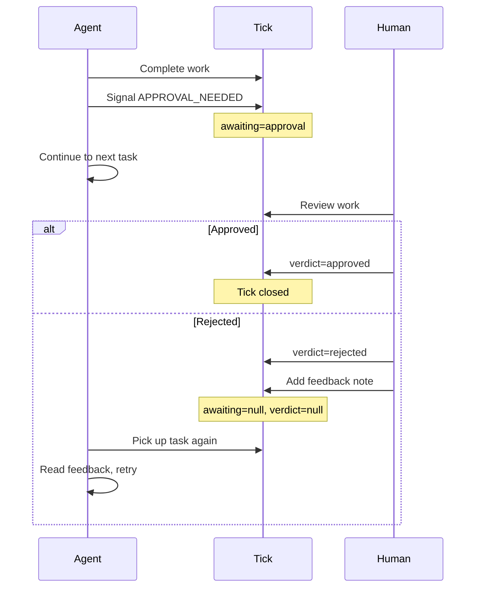
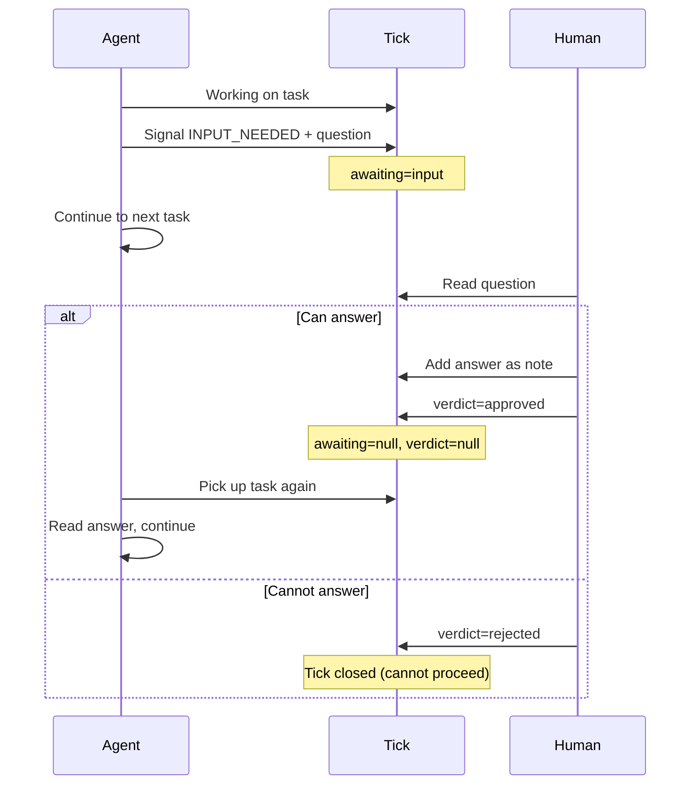
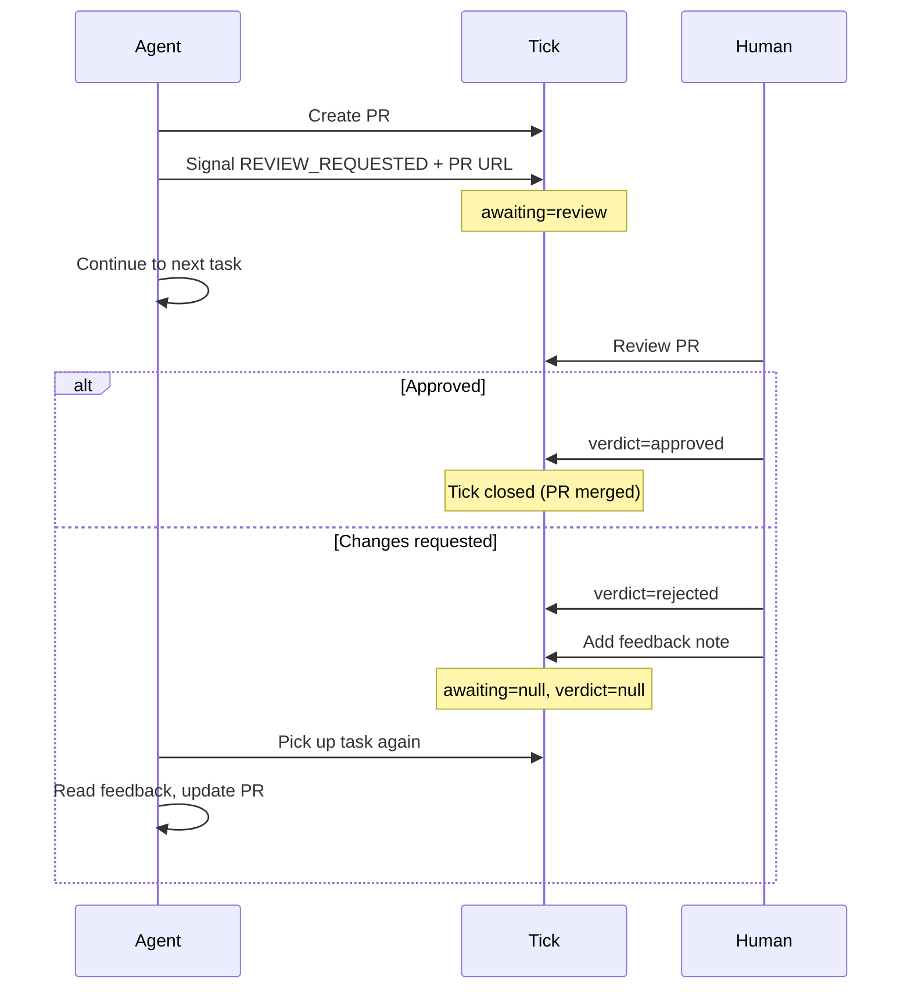
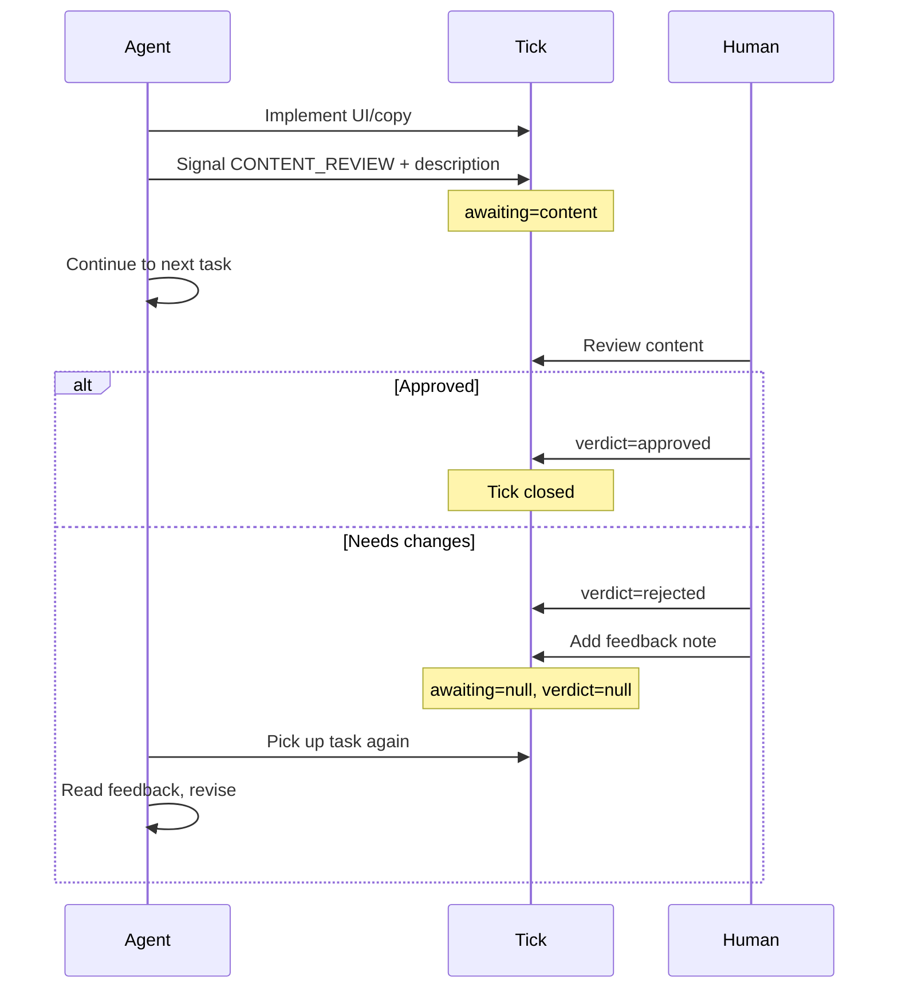
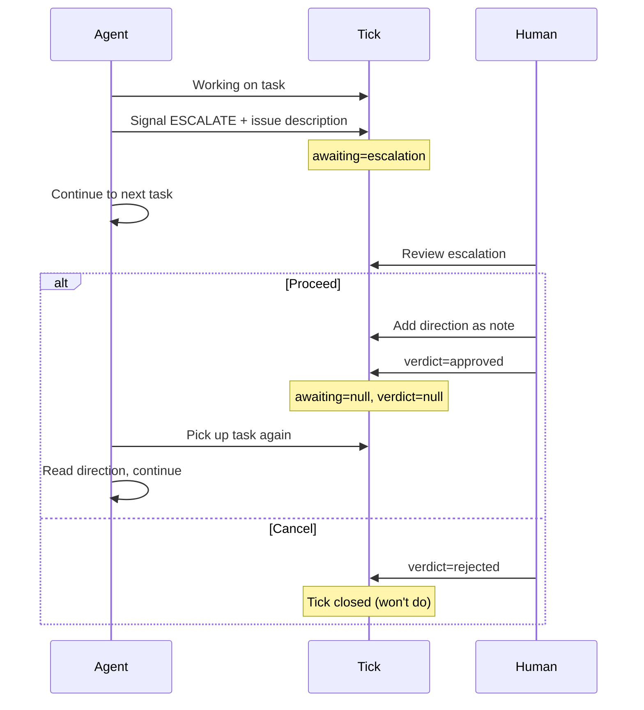
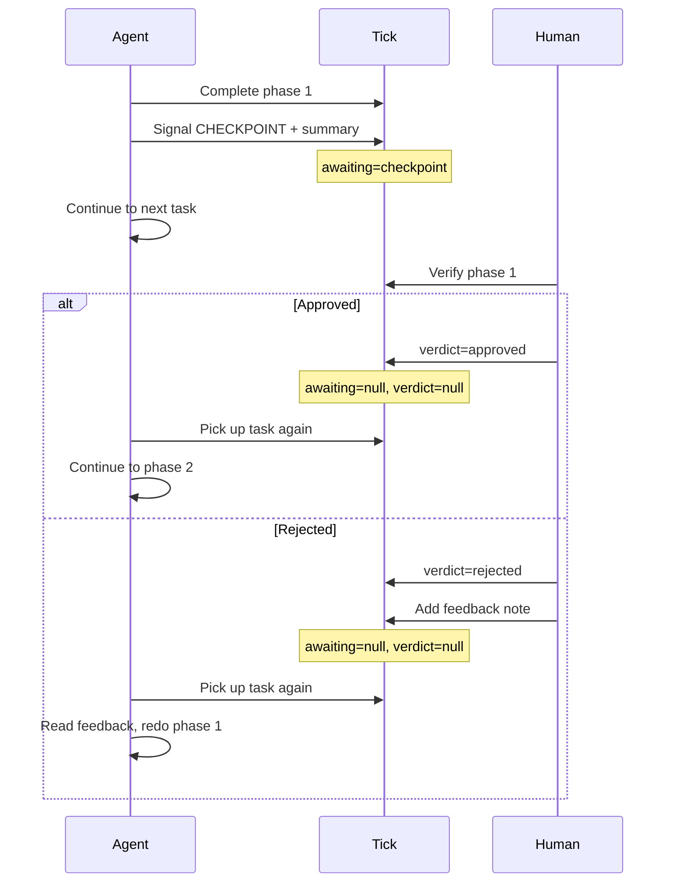
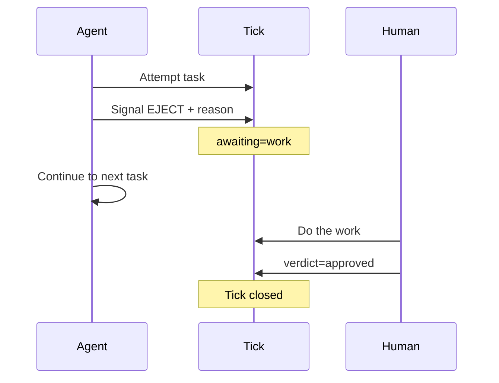
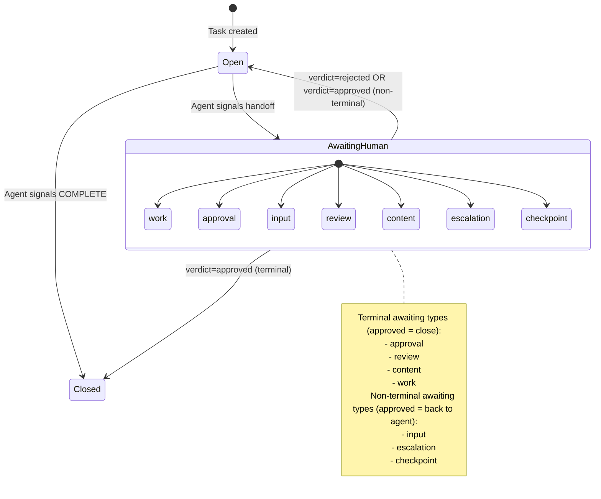
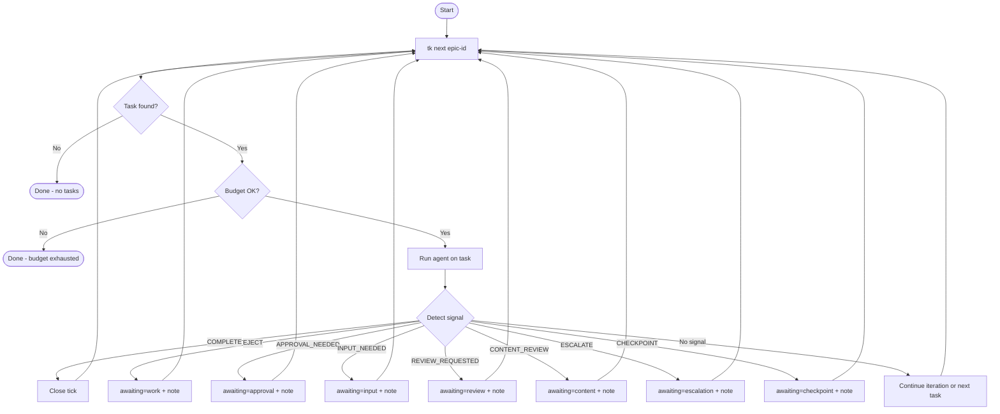

# Agent-Human Workflow Design

This document describes the collaborative workflow between AI agents (via ticker) and humans for task completion in ticks.

## Overview

Currently, ticks has a `manual` boolean flag that makes ticker skip tasks entirely. This document proposes a richer model where:

1. Agents can **hand off** tasks to humans for specific reasons (approval, input, review, etc.)
2. Humans can **respond** with a structured verdict (approved/rejected)
3. Ticker **continues working** on other tasks while waiting for human response
4. After human response, the task either **closes** or **returns to agent** with feedback

## State Model

### Two Enum Fields

```
awaiting: null | work | approval | input | review | content | escalation | checkpoint
verdict:  null | approved | rejected
```

### Awaiting Values

| Value | Meaning | Human Action Expected |
|-------|---------|----------------------|
| `null` | Agent's turn (default) | - |
| `work` | Human must do the task | Complete the work |
| `approval` | Agent done, needs sign-off | Approve or reject with feedback |
| `input` | Agent needs information | Provide answer (in notes) |
| `review` | PR needs code review | Review and approve or request changes |
| `content` | UI/copy needs human judgment | Judge quality, approve or give feedback |
| `escalation` | Agent found issue, needs direction | Decide how to proceed |
| `checkpoint` | Phase complete, verify before next | Approve to continue or reject to redo |

### Verdict Values

| Value | Meaning |
|-------|---------|
| `null` | No response yet (default) |
| `approved` | Human accepts/approves |
| `rejected` | Human rejects, needs changes |

### Notes

Freeform context (questions, feedback, answers) goes in notes. Notes are **supplementary** - they don't drive state transitions, but provide context for both agent and human.

## Workflow Scenarios

### 1. Approval Gate

Agent completes work but needs human sign-off before closing.

**Examples:** Security changes, database migrations, API changes



### 2. Input Required

Agent needs information only human can provide.

**Examples:** Business decisions, configuration choices, clarifications



### 3. PR Review

Agent creates PR but shouldn't merge without review.

**Examples:** Any code changes requiring review



### 4. Content/Design Review

Agent creates UI, copy, or design that needs human judgment.

**Examples:** Error messages, UI layouts, marketing copy, user-facing text



### 5. Escalation

Agent discovers something unexpected requiring human decision.

**Examples:** Security vulnerabilities, scope creep, architectural decisions



### 6. Checkpoint

Large task with intermediate verification points.

**Examples:** Data migrations, multi-phase refactors



### 7. Human Work (Eject)

Task requires human to complete (not just approve).

**Examples:** Manual configuration, physical setup, external system access



## State Transition Diagram



## Verdict Processing Matrix

| awaiting | verdict=approved | verdict=rejected |
|----------|------------------|------------------|
| `work` | Close tick | (invalid - human couldn't do it?) |
| `approval` | Close tick | Back to agent (with feedback) |
| `input` | Back to agent (with answer) | Close tick (can't proceed) |
| `review` | Close tick (merge PR) | Back to agent (with feedback) |
| `content` | Close tick | Back to agent (with feedback) |
| `escalation` | Back to agent (with direction) | Close tick (won't do) |
| `checkpoint` | Back to agent (next phase) | Back to agent (redo phase) |

## Agent Signal Protocol

Agents communicate via XML tags in output:

| Signal | Tag Format | Sets awaiting |
|--------|------------|---------------|
| Complete | `<promise>COMPLETE</promise>` | - (closes tick) |
| Eject | `<promise>EJECT: reason</promise>` | `work` |
| Approval needed | `<promise>APPROVAL_NEEDED: reason</promise>` | `approval` |
| Input needed | `<promise>INPUT_NEEDED: question</promise>` | `input` |
| Review requested | `<promise>REVIEW_REQUESTED: pr_url</promise>` | `review` |
| Content review | `<promise>CONTENT_REVIEW: description</promise>` | `content` |
| Escalate | `<promise>ESCALATE: issue</promise>` | `escalation` |
| Checkpoint | `<promise>CHECKPOINT: summary</promise>` | `checkpoint` |

The text after the colon is added as a note to provide context.

## Ticker Engine Loop



**Key behavior:** Ticker **never blocks** on human. After any handoff signal, it immediately proceeds to the next available task.

---

# Implementation: Changes to Ticks (tk CLI)

## Schema Changes

### New Fields

Add to tick schema:

```go
type Tick struct {
    // ... existing fields ...

    // Awaiting indicates the tick is waiting for human action
    // null means agent's turn, any other value means human's turn
    Awaiting *string `json:"awaiting,omitempty"` // work|approval|input|review|content|escalation|checkpoint

    // Verdict is the human's response to an awaiting state
    // Processed immediately when set, then cleared
    Verdict *string `json:"verdict,omitempty"` // approved|rejected
}
```

### Deprecate Manual Field

The `manual` field is superseded by `awaiting=work`:

```go
// Deprecated: Use Awaiting="work" instead
Manual bool `json:"manual,omitempty"`
```

Migration: `manual: true` → `awaiting: "work"`

## CLI Changes

### New Flags

```bash
# Create with awaiting
tk create "Task title" --awaiting work

# Update awaiting
tk update <id> --awaiting approval
tk update <id> --awaiting=null  # clear, return to agent

# Set verdict
tk update <id> --verdict approved
tk update <id> --verdict rejected
```

### New Filter Options

```bash
# List tasks awaiting human
tk list --awaiting              # all awaiting != null
tk list --awaiting approval     # specific type
tk list --awaiting input,review # multiple types

# Ready excludes awaiting (like it excludes manual)
tk ready                        # awaiting=null AND not blocked AND open
```

### Shorthand Commands

```bash
# Approve (verdict=approved, triggers processing)
tk approve <id>

# Reject with optional feedback note
tk reject <id>
tk reject <id> "Needs softer error messages"
```

### Note Author Flag

```bash
# Agent note (default, or explicit)
tk note <id> "PR ready: github.com/..."
tk note <id> "Context info" --from agent

# Human note (feedback, answers)
tk note <id> "Use Stripe for payments" --from human
```

## Verdict Processing Logic

When verdict is set, `tk` processes immediately:

```go
func processVerdict(tick *Tick) error {
    if tick.Verdict == nil || tick.Awaiting == nil {
        return nil
    }

    shouldClose := false

    switch *tick.Awaiting {
    case "work":
        // Human completed work
        shouldClose = (*tick.Verdict == "approved")
    case "approval", "review", "content":
        // Terminal states - approved means done
        shouldClose = (*tick.Verdict == "approved")
    case "input":
        // Approved = answer provided, continue; Rejected = can't proceed
        shouldClose = (*tick.Verdict == "rejected")
    case "escalation":
        // Approved = direction given, continue; Rejected = won't do
        shouldClose = (*tick.Verdict == "rejected")
    case "checkpoint":
        // Never closes - always back to agent
        shouldClose = false
    }

    // Clear state
    tick.Awaiting = nil
    tick.Verdict = nil

    if shouldClose {
        tick.Status = "closed"
    }

    return saveTick(tick)
}
```

## Query Changes

### tk next

Exclude tasks with `awaiting` set:

```go
func getNextTask(epicID string) *Tick {
    // Existing filters: open, not blocked, not manual
    // Add: awaiting == null

    tasks := listTasks(epicID)
    for _, t := range tasks {
        if t.Status == "open" &&
           !t.isBlocked() &&
           t.Awaiting == nil {  // NEW
            return &t
        }
    }
    return nil
}
```

### tk ready

Same filter - exclude awaiting:

```bash
tk ready  # only shows awaiting=null tasks
```

---

# Implementation: Changes to Ticker (Engine)

## Signal Detection

### Extend Signal Parsing

Current signals:
- `COMPLETE`
- `EJECT`
- `BLOCKED`

New signals to detect:

```go
type Signal string

const (
    SignalComplete        Signal = "COMPLETE"
    SignalEject           Signal = "EJECT"
    SignalBlocked         Signal = "BLOCKED"          // Legacy, maps to input
    SignalApprovalNeeded  Signal = "APPROVAL_NEEDED"
    SignalInputNeeded     Signal = "INPUT_NEEDED"
    SignalReviewRequested Signal = "REVIEW_REQUESTED"
    SignalContentReview   Signal = "CONTENT_REVIEW"
    SignalEscalate        Signal = "ESCALATE"
    SignalCheckpoint      Signal = "CHECKPOINT"
)

// ParseSignal extracts signal from agent output
func ParseSignal(output string) (Signal, string) {
    // Match <promise>SIGNAL_TYPE: context</promise>
    // or <promise>SIGNAL_TYPE</promise>

    re := regexp.MustCompile(`<promise>(\w+)(?::\s*(.+?))?</promise>`)
    matches := re.FindStringSubmatch(output)
    if matches == nil {
        return "", ""
    }
    return Signal(matches[1]), strings.TrimSpace(matches[2])
}
```

## Signal Handling

### Map Signals to Awaiting

```go
func (e *Engine) handleSignal(tick *Tick, signal Signal, context string) error {
    switch signal {
    case SignalComplete:
        return e.ticks.Close(tick.ID, "Completed by agent")

    case SignalEject:
        return e.setAwaiting(tick, "work", context)

    case SignalBlocked:
        // Legacy signal - treat as input needed
        return e.setAwaiting(tick, "input", context)

    case SignalApprovalNeeded:
        return e.setAwaiting(tick, "approval", context)

    case SignalInputNeeded:
        return e.setAwaiting(tick, "input", context)

    case SignalReviewRequested:
        return e.setAwaiting(tick, "review", context)

    case SignalContentReview:
        return e.setAwaiting(tick, "content", context)

    case SignalEscalate:
        return e.setAwaiting(tick, "escalation", context)

    case SignalCheckpoint:
        return e.setAwaiting(tick, "checkpoint", context)
    }
    return nil
}

func (e *Engine) setAwaiting(tick *Tick, awaiting, context string) error {
    // Update tick awaiting status
    if err := e.ticks.Update(tick.ID, "--awaiting", awaiting); err != nil {
        return err
    }

    // Add context as note
    if context != "" {
        if err := e.ticks.Note(tick.ID, context); err != nil {
            return err
        }
    }

    return nil
}
```

## Loop Changes

### Non-Blocking on Handoff

```go
func (e *Engine) Run(epicID string) error {
    for {
        // Check budget
        if e.budget.Exhausted() {
            return ErrBudgetExhausted
        }

        // Get next available task
        tick, err := e.ticks.Next(epicID)
        if err != nil {
            return err
        }
        if tick == nil {
            // No tasks available (all done or awaiting human)
            return nil
        }

        // Build context (include recent notes for feedback)
        context := e.buildContext(tick)

        // Run agent
        output, err := e.agent.Run(tick, context)
        if err != nil {
            return err
        }

        // Detect and handle signal
        signal, signalContext := ParseSignal(output)
        if signal != "" {
            if err := e.handleSignal(tick, signal, signalContext); err != nil {
                return err
            }
            // IMPORTANT: Continue to next task, don't block
            continue
        }

        // No signal - check iteration limits, continue or pause
        // ... existing logic ...
    }
}
```

### Context Building

Include recent notes when returning to a task after human feedback:

```go
func (e *Engine) buildContext(tick *Tick) string {
    var context strings.Builder

    // Get recent notes
    notes, _ := e.ticks.Notes(tick.ID)

    // Check if there's human feedback (from recent verdict processing)
    humanNotes := filterHumanNotes(notes)
    if len(humanNotes) > 0 {
        context.WriteString("## Human Feedback\n\n")
        context.WriteString("This task was previously handed to a human. Their response:\n\n")
        for _, note := range humanNotes {
            context.WriteString(fmt.Sprintf("- %s\n", note.Content))
        }
        context.WriteString("\nAddress this feedback before proceeding.\n\n")
    }

    return context.String()
}
```

## Agent Prompt Updates

### System Prompt Addition

Add to agent system prompt:

```markdown
## Handoff Signals

When you need human involvement, emit a signal and the system will hand off the task:

| Signal | When to Use |
|--------|-------------|
| `<promise>COMPLETE</promise>` | Task fully done |
| `<promise>APPROVAL_NEEDED: reason</promise>` | Work complete, needs human sign-off (security, migrations, API changes) |
| `<promise>INPUT_NEEDED: question</promise>` | Need human to answer a question or make a decision |
| `<promise>REVIEW_REQUESTED: pr_url</promise>` | PR created, needs code review |
| `<promise>CONTENT_REVIEW: description</promise>` | UI/copy/design needs human judgment |
| `<promise>ESCALATE: issue</promise>` | Found unexpected issue requiring human direction |
| `<promise>CHECKPOINT: summary</promise>` | Completed a phase, need verification before continuing |
| `<promise>EJECT: reason</promise>` | Cannot complete - requires human to do the work |

After emitting a handoff signal, the system will move to another task. When a human responds, you may be assigned this task again with their feedback in the notes.

## Reading Human Feedback

If this task was previously handed off, check the "Human Feedback" section above for the human's response. Address their feedback before proceeding.
```

---

# Migration Path

## Phase 1: Add Fields to Ticks

1. Add `awaiting` and `verdict` fields to schema
2. Add CLI flags (`--awaiting`, `--verdict`)
3. Add `tk approve` and `tk reject` commands
4. Update `tk next` and `tk ready` to exclude awaiting
5. Keep `manual` field working (deprecated but functional)

## Phase 2: Update Ticker Engine

1. Add new signal detection
2. Add signal → awaiting mapping
3. Change loop to continue after handoff signals
4. Add context building with human feedback

## Phase 3: Deprecate Manual

1. Migrate existing `manual: true` ticks to `awaiting: work`
2. Remove `--manual` flag (or alias to `--awaiting work`)
3. Update documentation

---

# Future Considerations

## Notification System

How does human know there's work waiting?

- CLI: `tk list --awaiting` in a watch loop
- Integration: Slack/email notifications
- Dashboard: Web UI showing pending items

## Timeout Handling

What if human doesn't respond?

- Auto-escalate after N days?
- Notify/remind?
- Allow agent to retry with different approach?

## Reviewer Routing

Different humans for different review types:

```
awaiting: content
reviewer: design  # optional field for routing
```

## Audit Trail

Track handoff history:

```
handoff_history: [
  { signal: "APPROVAL_NEEDED", timestamp: "...", context: "..." },
  { verdict: "rejected", timestamp: "...", feedback: "..." },
  { signal: "APPROVAL_NEEDED", timestamp: "...", context: "..." },
  { verdict: "approved", timestamp: "..." }
]
```
